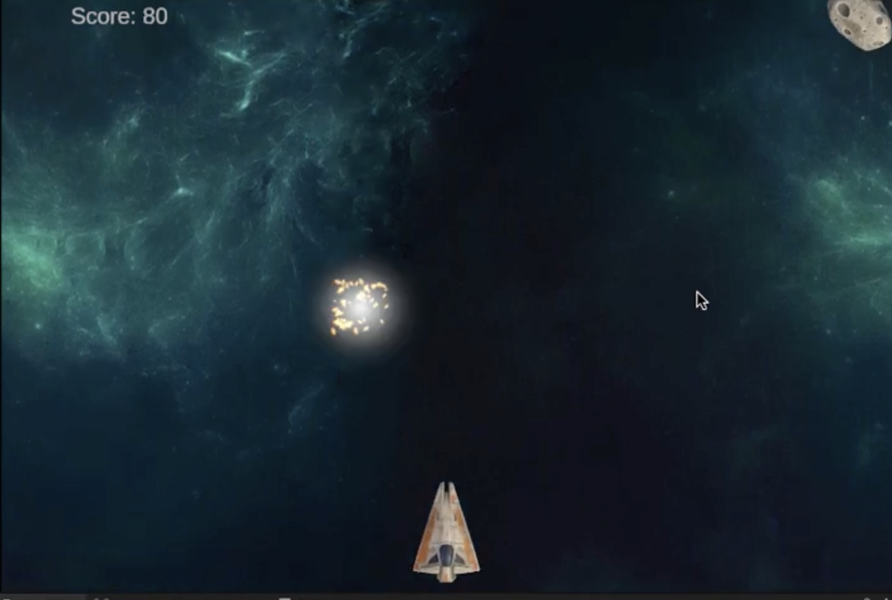

# 🚀 Space Shooter Game

A 2D arcade-style space shooter built with Unity and C#. Pilot your spaceship, destroy enemy objects, and survive as long as you can in deep space!

---

## 🎮 Gameplay Features

- 🛸 Player-controlled spaceship with smooth movement and shooting mechanics  
- 👾 Enemy spawning system with increasing difficulty  
- 💥 Collision detection and explosion effects  
- ❤️ Player health system with lives and game over screen  
- 🧠 Score tracking and UI display  
- 🔊 Sound effects and background music for immersive experience

---

## 🛠 Tech Stack

- **Game Engine:** Unity (2022 or later)  
- **Language:** C#  
- **Assets:** Unity Asset Store (custom & free assets)  
- **Platform:** Desktop / WebGL

---

## 📷 Screenshots

  

---

## 🚧 Future Improvements

- Power-ups and new enemy types  
- Leaderboard and score saving  
- Level progression and boss battles  
- Mobile touch controls

---

## ▶️ How to Play

1. Clone or download the repository  
2. Open the project in Unity  
3. Press `Play` in the Unity Editor to start the game  
4. Use **arrow keys / WASD** to move and **spacebar** to shoot  
5. Avoid enemies and survive as long as possible!

---

## 📁 Folder Structure

Assets/
├── Scripts/ # Game logic scripts
├── Prefabs/ # Player, enemies, bullets
├── Scenes/ # Main game scene
├── Audio/ # Music and sound effects
└── UI/ # Score, game over screen

---

## 🙌 Credits

- Game developed by me as part of the **Mobile Game Development Bootcamp**  
- Assets from Unity Asset Store and free online resources  
- Sound effects from freesound.org

---

## 📄 License

This project is open-source for educational purposes. Feel free to fork and build upon it!
